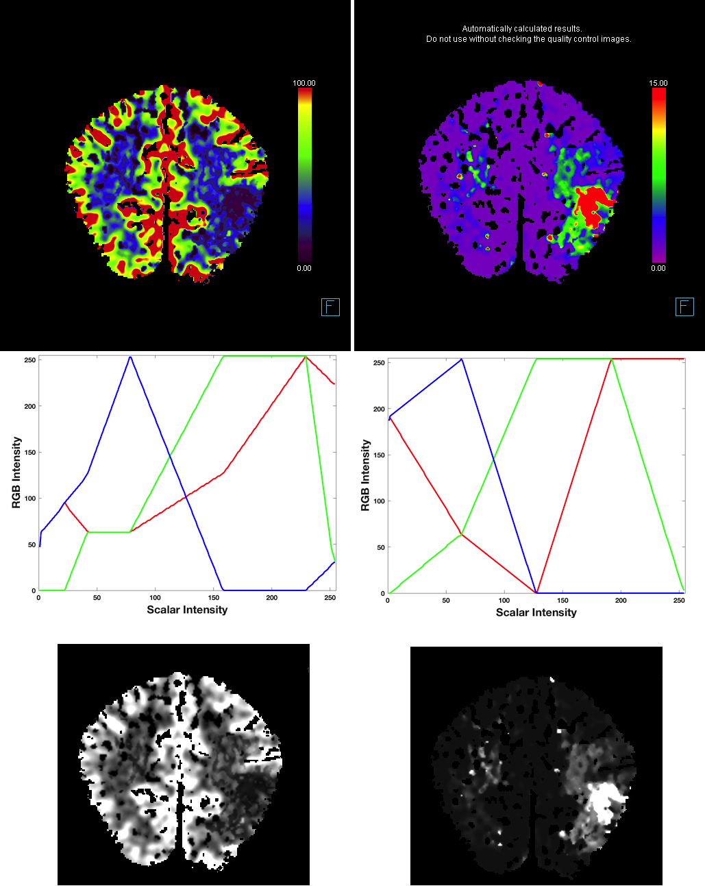
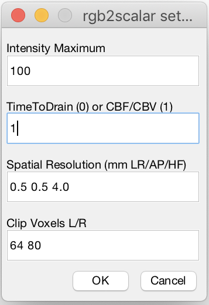

## About

Siemens software can derive several important measures from CT Perfusion scans, including
Cerebral Blood Volume (CBV), Cerebral Blood Flow (CBF) and Time to Drain (TTD). However, the resulting DICOM images are saved as for display purposes only, which makes it difficult to conduct research with these images. This repository outlines a method for converting these DICOM images into the scientific NIfTI format for exploratory analyses. These methods are obviously focused on research, and should not be used for clinical purposes. The image below shows a CBV (upper left) and TTD (upper right) image from a Siemens scanner. There are several issues we must overcome to analyze these images.

 - While visual inspection reveals the images are calibrated from 0..100 and 0..15, no information in the DICOM file allows one to determine the image range automatically.
 - Differences in values are shown using a custom Red, Green, Blue (RGB) color scheme with 254 distinct colors (shown as a gradient on the right of the image). There is no simple formula to convert the red, green and blue values of the image to the calibrated scalar range. Note that the actual images include more than 254 distinct colors, interpolating between values in the colorbar.
 - The DICOM images provide no spatial information, such as the resolution of the images, or even which side is the left.
 - The colorbars are burnt in to the image. These may disrupt any normalization.
 - Voxels that do not meet a threshold aree set to zero, with no partial volume effects. Therefore, we must use nearest-neighbor interpolation when reslicing these images. There is no signal from the scalp or other tissues that can guide normalization. 

The scripts of this repository require Matlab and [SPM12](https://www.fil.ion.ucl.ac.uk/spm/software/spm12/). The script rgb2scalar.m is used to determine the conversion of the RGB values to a scalar range. It can read the color schemes (cbfd.png, cbvd.png, ttd.png) and genrates the plots shown in the lower panels of the figure above. The findings of this script have been incorporated into the convert_ctp script.

To convert Siemens CT images, one must complete the following steps.

 1. Convert DICOM images to NIfTI format using [dcm2niix](https://github.com/rordenlab/dcm2niix) (either from the command line or using the graphical interface of [MRIcroGL](https://github.com/rordenlab/MRIcroGL12)).
 2. Run the Matlab script convert_ctp. It will ask you to run select the image and the a graphical display asks you to provide a few details.
 

 
